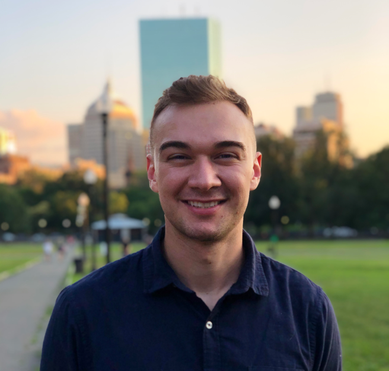

*To go directly to my projects, click [here](./projects.md). Refer to the navigation bar on the left to see any of my portolfio pages!*

# About me

I recently finished up my MS in Computer Engineering at Duke University, where I gained a deep understanding of the underlying principles of computer systems, algorithms, and machine learning. I'm an aspiring ML engineer and make a point to spend time every day perfecting my craft and learning about advancements in the industry.

Throughout my academic career, I have focused on developing my skills in data analysis, machine learning, and DevOps/automation. I've worked on numerous projects exploring the intersection of these interests, which I hope to demonstrate through this portfolio. My expertise includes training, evaluating, and deploying machine learning models and completing end-to-end data science projects.

In addition to my academic pursuits, I've gained practical experience through my internship with the LA Clippers doing data analytics work (summers 2021 & 2022). You can read more about my time with the Clippers [here](./clippers.md).

As a dedicated and detail-oriented engineer, I'm committed to delivering high-quality solutions to complex problems. I'm passionate about using my skills to advance the field of machine learning and contribute to the development of new and innovative technologies.

In my free time, I enjoy keeping up with the latest developments in machine learning and attending industry events and conferences. I'm also somewhat of a basketball fanatic and find it to be a fascinating space for the application of ML. I'm excited about the opportunities that lie ahead and look forward to making a meaningful impact as a machine learning practitioner.

## Undergraduate Studies
I started my undergraduate degree at Lasell University as a business major and a part of the [men's basketball team](https://laserpride.lasell.edu/sports/mbkb/2017-18/roster). During my second semester, I took an introductory computing class and absolutely fell in love with the field of computer science. I then knew I wanted programming and analytics to be part of my career. I later transferred to Bryant University where I received a Bachelor's degree in data science with minors in business administration and mathematics. Outside of academics, I was part of the [men's ultimate frisbee team](https://www.bryantbulldogs.com/sports/club/Ultimate/Roster/2019-2020) and helped establish the [school's first club basketball team](https://www.bryantbulldogs.com/sports/club/MBasketball/index).

