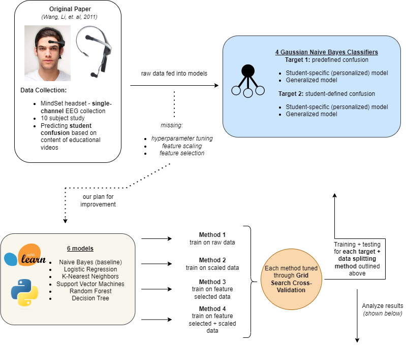

# Projects Summary

Below, I'll list some of my favorite projects I've had the opportunity to work on. Most projects have an associated demo showing how all the moving pieces work together. I'll also place a link to each repo in case you'd like to take a deeper look!

## Image Classifier Web App
This is a web application that allows users to upload an image and receive a classification prediction for that image using a pre-trained deep learning model. The application uses Flask as the backend framework, which invokes an AWS Lambda function to make requests to a pre-deployed Amazon SageMaker endpoint for image classification. The predicted labels are then returned to the user and displayed on the web page.

[Link to the project](https://github.com/abzdel/image-classifier-web-app)

**Demo:**

<iframe width="640" height="385"
src="https://www.youtube.com/embed/8fJlxViFTqs">
</iframe>

 

## Improving Student Course Feedback through EEG Brain Signal Models

Our research focused on addressing the challenge of obtaining feedback on lesson clarity in online learning platforms. We built upon previous work by graduate student researchers at Carnegie Mellon University who designed a classifier using an EEG headset recorder device to detect student confusion.

Our objective was to *reproduce and enhance their results* by implementing **a more rigorous model selection process, feature selection, scaling, and hyperparameter optimization using grid search cross-validation.** Through these methods, we **increased model performance by 27%** and included an analysis to ensure our results were generalizable.

[Link to the project](https://github.com/abzdel/BCI-EEG-Classification)  
*this project does not have a demo, [but the slides and report can be found here](https://github.com/abzdel/BCI-EEG-Classification/tree/main/reports).*

    

 

## Summarize CLI - a Hugging Face and AWS Sagemaker tool
A command line tool that takes a Hugging Face summarizer model ([pegasus-xsum](https://huggingface.co/google/pegasus-xsum) by default), deploys it to AWS Sagemaker, and queries it for inference. I made this tool utilizing Python, Bash, and a cool program named [Bashly](https://bashly.dannyb.co/) to help me develop the CLI arguments and flags. In the future, I'd like to add more functionality to use custom models and send multiple queries at once for longer texts.

[Link to the project](https://github.com/abzdel/Summarize-CLI)

**Demo:**

<iframe width="640" height="385"
src="https://www.youtube.com/embed/tRXR8zne2Q0">
</iframe>

 

## NBA Over/Under Prediction App
Streamlit app that automatically pulls newest data, predicts on it, and serves betting predictions to the user. Utilizes GitHub Actions for continuous integration and continuous delivery to AWS EC2. For this project, I used Python and a fairly simple Sci-kit Learn linear regression model (emphasis was more on the CI/CD than model tuning).

[Link to the project](https://github.com/abzdel/NBA_Over_Under_Prediction_App)

**Demo:**

<iframe width="640" height="385"
src="https://www.youtube.com/embed/x3TN3ZFBzu8">
</iframe>

 

## Serverless Machine Learning Model
A linear model used to classify breast cancer instances using UCI'S breast cancer diagnostic data set. Model is trained using AWS Sagemaker and invoked using Amazon API Gateway and an AWS Lambda function.

[Link to the project](https://github.com/abzdel/Machine-Learning-Serverless)

<iframe width="640" height="385"
src="https://www.youtube.com/embed/8fJlxViFTqs">
</iframe>

 

## Azure Databricks Cluster CLI
CLI built in Rust and Bash that allows you to provision custom clusters in Databricks using the Databricks REST API.

[Link to the project](https://github.com/abzdel/databricks-cluster-cli)

**Demo:**

<iframe width="640" height="385"
src="https://www.youtube.com/embed/d8yQWnPbCHI">
</iframe>

 

## Machine Learning API
FastAPI application that predicts Jayson Tatum's points per game based on continuously updated data from ESPN. Deploys automatically to AWS AppRunner.

[Link to the project](https://github.com/abzdel/ML_API_on_AWS)

**Demo:**

<iframe width="640" height="385"
src="https://www.youtube.com/embed/RRpDN-AFYsE">
</iframe>

 

## Finding Traumatic Brain Injury in CT Scans
For my image & video processing course at Duke, my teammates and I used multi-Otsu thresholding to segment potential instances of TBI from brain CT scans. This involved a variety of preprocessing steps to ensure consistency as well as researching and testing both machine learning methods and other segmentation methods to find an optimal solution.

<iframe src="https://drive.google.com/file/d/1OlW61qlPdmpENmfDZAYqmE5SPRN4SOdT/preview" width="640" height="480" allow="autoplay"></iframe>

## Estimating the Impact of Opioid Control Policies
Along with a small group, I analyzed opioid-related policies across various states to determine whether they had an impact on both the prescription rates and overdose rates of opioids. This project includes a [PowerPoint presentation](https://github.com/abzdel/Opioid-Analysis/blob/main/30_results/Presentation_Opioid%20Control.pptx) going over our findings in a more succinct way.

[Link to the project](https://github.com/abzdel/Opioid-Analysis) 
